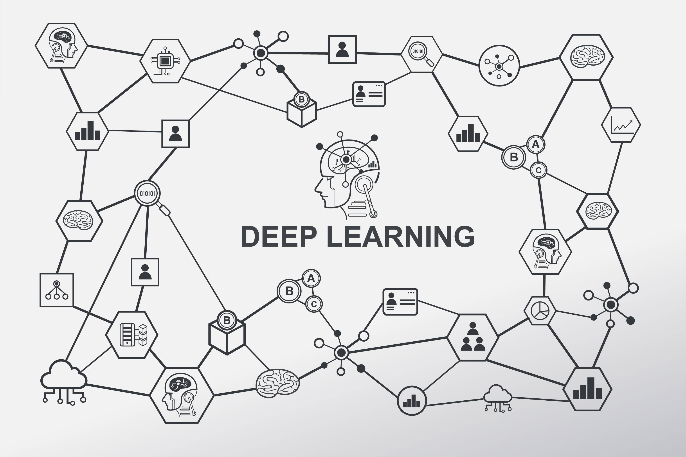

# Deep Learning

## Table of Contents

- [Introduction](#introduction)
- [Key Concepts](#key-concepts)
- [Deep Learning Architectures](#deep-learning-architectures)

## Introduction

**Deep Learning** is a field of artificial intelligence that mimics the workings of the human brain in processing data for use in decision making. It involves training neural networks, which are made up of multiple layers of neurons, to perform tasks such as classification, regression, and feature extraction.

Deep learning has been the driving force behind major breakthroughs in AI applications such as image recognition, natural language processing (NLP), autonomous systems, and more.

## Key Concepts

- **Artificial Neural Networks (ANNs)**: A set of algorithms that mimic the function of the human brain, consisting of input, hidden, and output layers of neurons.
- **Activation Functions**: Functions such as ReLU, Sigmoid, and Tanh that determine the output of a neural network's node.
- **Backpropagation**: The method by which neural networks adjust their weights based on the error rate obtained in the previous iteration.
- **Optimization**: Techniques like Gradient Descent used to minimize the loss function and update weights.
- **Overfitting & Underfitting**: Challenges in model performance where overfitting occurs when the model learns noise, and underfitting happens when it doesn’t learn enough patterns from the data.

## Deep Learning Architectures

1. **Feedforward Neural Networks (FNNs)**:
   These are the simplest type of artificial neural networks where connections between the nodes do not form a cycle.

2. **Convolutional Neural Networks (CNNs)**:
   CNNs are primarily used for image data and are designed to automatically detect important features in images through convolution layers.

3. **Recurrent Neural Networks (RNNs)**:
   These networks have connections that form directed cycles, making them excellent for sequential data, such as time series or language models.

4. **Long Short-Term Memory Networks (LSTMs)**:
   A special type of RNN capable of learning long-term dependencies, making them useful for tasks like language modeling and machine translation.

5. **Generative Adversarial Networks (GANs)**:
   GANs consist of two networks—a generator and a discriminator—that work against each other to produce realistic data outputs, like images or sound.

